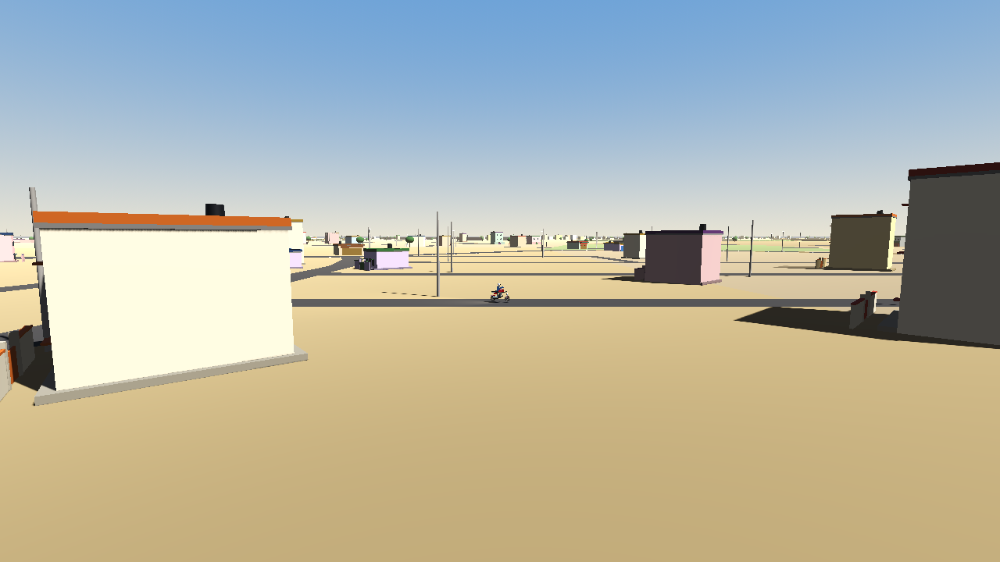
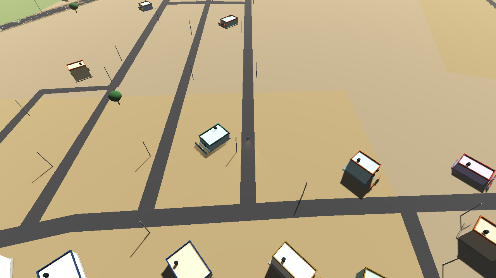
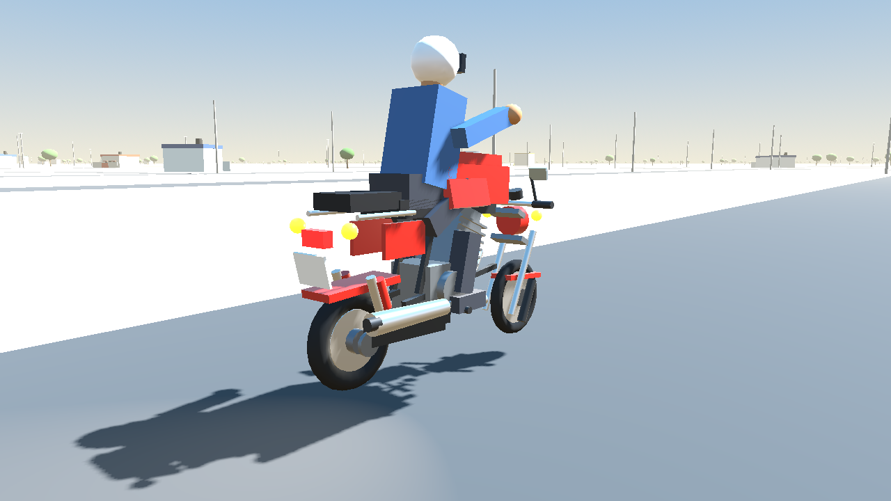

# Darsi — Small Town Ride

An open-world motorcycle game set in **Darsi, Prakasam district, Andhra Pradesh 523247**.

The town is not an invented stand-in. Every road centreline, building footprint, irrigation
tank, canal and point of interest in the world is the real OpenStreetMap geometry of Darsi,
projected into a local metre frame around the town centre at **15.7667 N, 79.6833 E**.



| | |
|---|---|
|  |  |

## What is actually in the world

Built from `data/darsi_world.json`, which is generated from a live Overpass extract:

| | |
|---|---|
| Real road segments | 194 (≈ 68 km of carriageway) |
| Named roads | SH51, Podili – Vinukonda Road, Darsi – Chimakurthy Road, MDR087, APSRTC Darsi Bus Station Inner Road, S.S.R. Nagar residential road |
| Real OSM building footprints | 91, extruded with heights from `building:levels` where tagged |
| Points of interest | 27 — the APSRTC bus station, Darsi police station, Jamal Hospital, Sri Raja Rajeswari Hospitals, Srinivasa / Bhaskara / Venkateswara movie theatres, Gowthami Grammar School, fuel pumps, tractor dealers |
| Water | three village tanks plus the **Ongole branch canal** |
| Street frontage | ~1,000 procedurally laid-out walled plots on the real streets, because OSM has not traced most of Darsi's houses |
| Countryside | ~420 bunded, cropped fields on the land the real road network encloses |
| Furniture | ~1,500 electricity poles and street lamps, ~1,000 neem/palm trees |

The geometry is clearly separated: anything derived from OSM is tagged as such, and every
procedurally generated object is marked `procedural_infill` in its node metadata and
documented in [`docs/MAP_PIPELINE.md`](docs/MAP_PIPELINE.md).

## The motorcycle

A fictional, legally distinct 150 cc Indian commuter bike (the "Sahaja Vega 150"), simulated
as a real **single-track rigid body**, not a kinematic placeholder:

* two raycast suspension units with spring/damper forces and a clamped damper term,
* a single-cylinder torque curve (13 Nm @ 6500 rpm, 9500 rpm limiter) through a five-speed
  gearbox with primary and final reduction, delivered to the rear contact patch,
* tyre forces limited by a friction circle, so power and grip trade off against each other,
* yaw produced by the lateral force at the steered front contact patch — the bike is never
  rotated by writing to `rotation.y`,
* inertia-scaled, critically damped rider balance: the machine leans into corners up to the
  edge of the tyre and is held upright the way a rider holds it up,
* aerodynamic drag, rolling resistance, engine braking, fuel burn and an odometer.

The model is procedural but genuinely motorcycle-shaped: spoked wheels with brake discs,
telescopic forks with a 26° rake and visible travel, a twin-cradle frame, a finned
single-cylinder engine, swingarm and twin rear shocks, chrome exhaust, tank with knee
recesses, mudguards, mirrors, indicators and a seated rider.

## Controls

| Key | Action |
|---|---|
| `W` / `S` | throttle / front brake |
| `A` / `D` | steer |
| `Space` | rear brake |
| `C` | camera (chase / close / cockpit / cinematic) |
| `M` | minimap ↔ full map |
| `E` | interact with the nearest landmark (refuel at a pump) |
| `R` | recover onto the nearest road |
| `F` `L` `H` `T` `B` | refuel, lights, horn, skip time, ride mode |

Touch controls appear automatically on devices with a touchscreen.

## Running it

```bash
godot --path . scenes/main.tscn          # play
godot --headless --script tests/headless_test.gd   # 55 acceptance checks
python tests/test_world_manifest.py       # 26 data checks
```

## Regenerating the map

The import runs in CI because it needs network access:

```bash
python tools/fetch_darsi_osm.py --output data/osm/darsi_raw.json   # live Overpass query
python tools/build_world.py                                        # -> data/darsi_world.json
python tools/render_map.py                                         # -> docs/darsi_map_preview.svg
```

`data/osm/darsi_raw.json` is the verbatim Overpass answer, kept so that every piece of the
world can be traced back to a specific OSM element id.

## Continuous integration

`.github/workflows/godot.yml` installs Godot 4.3, imports the project, type-checks every
script, runs the headless acceptance tests, smoke-runs the real game scene, renders the
screenshots in this README with software OpenGL, and exports a Linux build. The full log of
the most recent run is committed to [`.ci/last-run.md`](.ci/last-run.md).

## Attribution and licensing

Map data © OpenStreetMap contributors, available under the
[Open Database Licence](https://www.openstreetmap.org/copyright) (ODbL 1.0). No satellite
imagery, no proprietary POI databases and no manufacturer trade dress are used anywhere in
this project; all meshes are generated from primitives at runtime.
